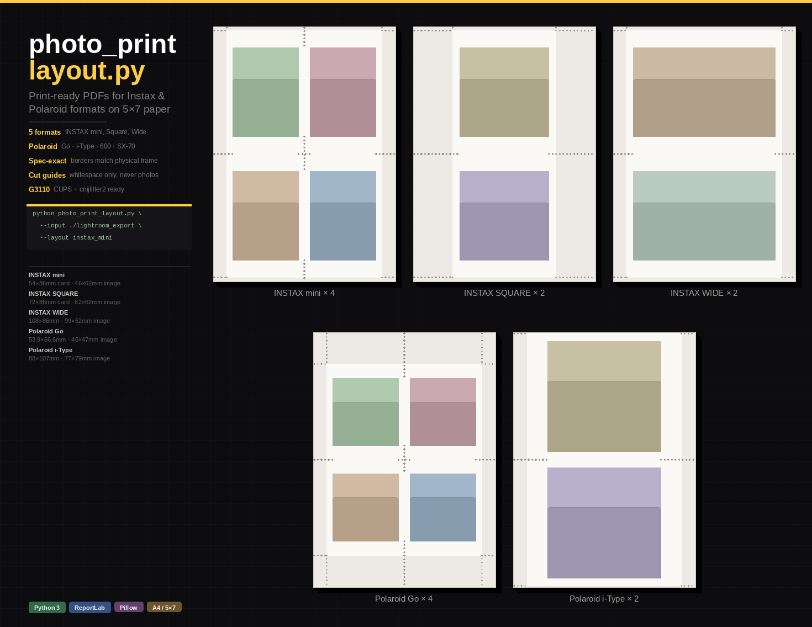

# 5x7 Photo Print Layout Generator



A Python tool that creates print-ready PDFs for 5x7 paper with multiple layout options. Designed for home printing small photos for gifts, scrapbooks, wallets, and more.

---

## The Story: Why 5x7 Paper?

**5x7 inch paper is the secret weapon for affordable home photo printing.**

When you want to print small photos—wallet-sized prints for family, mini portraits for gifts, or photos for scrapbooking—buying specialty photo paper in every size gets expensive and wasteful. The solution? **Use 5x7 paper as a universal canvas.**

Here's the magic:

| Layout | Photos per Sheet | Final Size (each) | Perfect For |
|--------|------------------|-------------------|-------------|
| **4-up** | 4 photos | ~2.3" × 3.3" | Wallet photos, ID photos, trading cards, mini gifts |
| **2-up** | 2 photos | ~4.7" × 3.3" | Larger wallet prints, small framed photos |

### Why This Works

1. **5x7 is widely available** — Canon, Epson, HP all sell glossy/matte 5x7 photo paper affordably
2. **Perfect divisibility** — 5x7 divides cleanly into wallet-sized slots with minimal waste
3. **Home printer friendly** — Most inkjet printers handle 5x7 better than 4x6 (less curl, better feed)
4. **Cut-to-size flexibility** — Light gray cut lines guide you to trim perfectly

### The Workflow

1. **Export from Lightroom/Photos** → folder of JPGs
2. **Run this script** → generates PDFs with photos arranged on 5x7 pages
3. **Print at 100% scale** → no scaling, borderless OFF
4. **Cut along the dashed lines** → perfect wallet prints every time

This tool was built specifically for the **Canon G3110** (MegaTank) printer using the **Canon PRINT Inkjet/SELPHY** mobile app, but works with any printer that supports 5x7 paper.

---

## Installation

### Prerequisites

- Python 3.10 or higher
- A virtual environment (recommended)

### Setup

```bash
# Clone or download the repository
cd 5-by-7-print-py

# Create and activate a virtual environment
python3 -m venv .venv
source .venv/bin/activate  # On Windows: .venv\Scripts\activate

# Install dependencies
pip install reportlab Pillow
```

### Dependencies

| Package | Purpose |
|---------|---------|
| `reportlab` | PDF generation |
| `Pillow` | Image processing (resize, crop) |

---

## Usage

### Drag & Drop (Easiest)

**Windows:** Drag your photo folder onto `photo-layout-windows-amd64.exe`

**macOS:** 
1. First time only: `chmod +x photo-layout-macos-amd64` in Terminal
2. Drag your photo folder onto the executable

**Linux:** Drag your photo folder onto `photo-layout-linux-amd64`

The PDFs will be created in the same folder as your photos. The window stays open so you can see the results.

---

### Command Line

Download from [Releases](../../releases/latest), then:

```bash
# Generate both 4-up and 2-up layouts (default)
./photo-layout --input /path/to/photos

# Generate only 4-up layout
./photo-layout --input /path/to/photos --layout 4up

# Generate only 2-up layout  
./photo-layout --input /path/to/photos --layout 2up

# Specify custom output folder
./photo-layout --input /path/to/photos --output /path/to/output
```

On Windows, use `photo-layout.exe` instead.

### Using Python Directly

```bash
# Generate both 4-up and 2-up layouts (default)
python photo_print_layout.py --input /path/to/photos

# Generate only 4-up layout
python photo_print_layout.py --input /path/to/photos --layout 4up

# Generate only 2-up layout  
python photo_print_layout.py --input /path/to/photos --layout 2up

# Specify custom output folder
python photo_print_layout.py --input /path/to/photos --output /path/to/output
```

### Command Line Options

| Option | Short | Description | Default |
|--------|-------|-------------|---------|
| `--input` | `-i` | Folder containing photos (required) | — |
| `--layout` | `-l` | Layout type: `4up`, `2up`, or `both` | `both` |
| `--output` | `-o` | Output folder for PDFs | Same as input |

### Supported Image Formats

- JPEG (`.jpg`, `.jpeg`)
- PNG (`.png`)
- TIFF (`.tif`, `.tiff`)
- WebP (`.webp`)

### Example

```bash
# Export photos from Lightroom to ~/Downloads/wedding-prints
# Then run:
python photo_print_layout.py -i ~/Downloads/wedding-prints

# Output:
# ~/Downloads/wedding-prints/photos_4up.pdf
# ~/Downloads/wedding-prints/photos_2up.pdf
```

---

## Printing Instructions

### General Settings (Any Printer)

1. Open the generated PDF
2. **Print at 100% scale** — do NOT use "Fit to Page" or "Shrink to Fit"
3. Select **5x7 inch** paper size
4. Turn **Borderless printing OFF** (the layouts account for margins)
5. Use **High Quality** print setting for best results

### Canon PRINT Inkjet/SELPHY App

1. Open the PDF in the Canon PRINT app
2. Select paper size: **5x7 / 13x18cm**
3. Borderless: **OFF**
4. Quality: **High**
5. Print!

### After Printing

Use scissors or a paper cutter to trim along the **light gray dashed lines**. The lines are designed to be subtle enough to not show if you cut slightly inside them.

---

## Technical Details

### Page Layout

- **Paper size**: 5" × 7" (portrait orientation)
- **Outer margin**: 0.12" from paper edge
- **Photo gap/border**: 0.08" between photos
- **Output DPI**: 300 (optimal for photo printing)

### Image Processing

- Images are **resized and center-cropped** to fill each cell completely (cover mode)
- Original aspect ratios are preserved during resize, then cropped to fit
- JPEG output at 95% quality for embedded images

---

## License

MIT License — use freely for personal or commercial projects.
